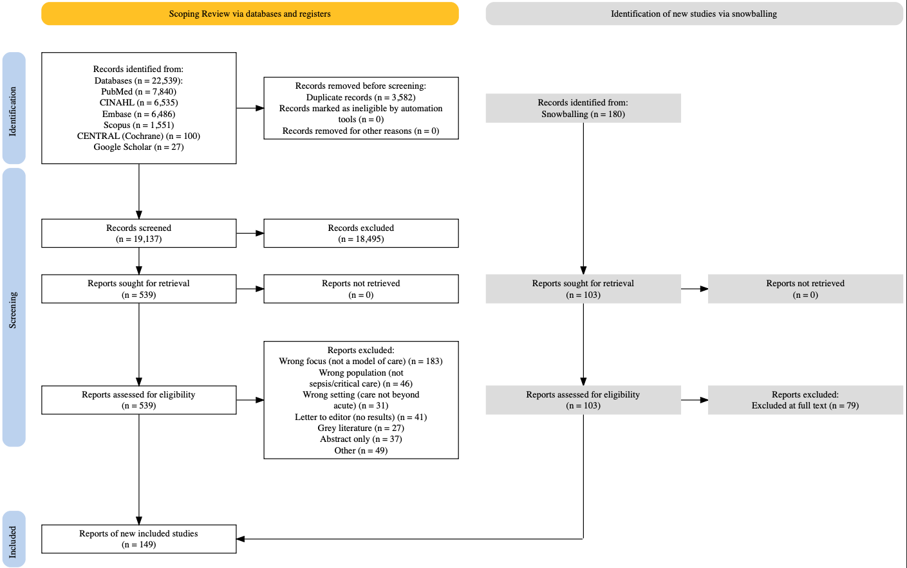

## Drawing a PRISMA 2020 flow diagram in R
If you have ever put together a systematic review, you will know the PRISMA flow diagram: that box-and-arrow chart showing how many records you found, screened, excluded, and finally included. For a long time I thought you could only manually build this in word or canva, nudging boxes around and re-typing numbers every time a count changed. It worked, but it was fiddly and very easy to get wrong.

Then I found the `PRISMA2020` R package, and it changed how I do this completely. Here is how I got it working, including where to find the template and the actual code I used.

### What the package does
`PRISMA2020` was built by Haddaway and colleagues to produce flow diagrams that follow the PRISMA 2020 standard. You fill in a simple CSV with your record counts, point R at it, and the package draws the whole diagram for you. You can output a static image, or an interactive HTML version where each box carries a tooltip or a hyperlink.

### Step 1: get the package and the CSV template

Install it from CRAN:

```         
install.packages("PRISMA2020")
library(PRISMA2020)
```

To locate the bundled template and see where it lives on your machine:

```         
csvFile <- system.file("extdata", "PRISMA.csv", package = "PRISMA2020")
csvFile   # prints the full path so you can open and copy it
```

Open that file, save a copy into your project, and fill in your own numbers.

### Step 2: fill in your counts

The template is one row of data with a column for each number the diagram needs: records from databases and registers, records from other sources such as citation searching and websites, duplicates removed, records screened and excluded, reports sought and not retrieved, and so on.

For my review the records came in from seven different sources, so I made sure each one landed in the right column before reading the file back into R.

### Step 3: the code I used

Once the CSV was filled in, the rest was short:

```         
# Read in my filled-in template
data <- read.csv("data/prisma.csv")

# Convert it into the structure the package expects
data <- PRISMA_data(data)

# Build the diagram
plot <- PRISMA_flowdiagram(
  data,
  fontsize    = 12,
  interactive = FALSE,   # set TRUE for an interactive HTML version
  previous    = FALSE,   # I had no previous-version arm
  other       = TRUE     # I did have "other" sources, so keep this on
)

plot

PRISMA_save(plot, filename = "prisma_flowdiagram.png", filetype = "PNG")
```

Two arguments are worth knowing, because they caught me out at first. `previous` controls the left-hand arm for studies carried over from an earlier version of the review, and `other` controls the arm for records found through methods other than database searching. If your diagram looks off or has empty boxes, these two toggles are usually the culprit.

### The result

Here is the finished diagram for my review:


